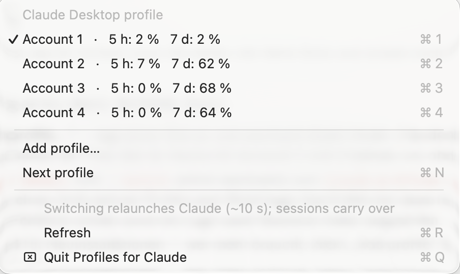

# Profiles for Claude Desktop (macOS)

Use several Claude accounts in **one** Claude Desktop app — switch from the menu bar instead of signing out and back in. Your Claude Code sessions (the *Code* tab) follow you to whichever account is active.

> Unofficial. Not affiliated with or endorsed by Anthropic. It works by moving the app's data directory around, so an app update that changes the internal layout may break it — see [Caveats](#caveats).



## Why

Claude Desktop knows exactly one sign-in at a time. If you keep a personal account and a work account (or one per client), every switch means sign out → sign in → lose your place. This tool gives the app *profiles*, the way Chrome and Slack have them:

- **One app in the Dock.** No second copy of Claude, no `--user-data-dir` juggling.
- **Menu bar switcher.** Shows the active profile and its usage; click another profile to switch. The app relaunches in about ten seconds.
- **Code-tab sessions carry over.** Every profile sees the same session list, so you can continue a session under a different account.
- **Import old sessions.** Sessions you started in the Claude Code CLI or the VS Code extension can be added to the app's sidebar.

## Install

Requirements: macOS 13+, [Claude Desktop](https://claude.ai/download), Xcode Command Line Tools (`xcode-select --install`, needed to compile the tiny menu bar app).

```bash
git clone https://github.com/erorplex/claude-desktop-profiles-macos.git
cd claude-desktop-profiles-macos
./install.sh
```

This installs the `claude-profiles` CLI to `~/.local/bin`, builds **Profiles for Claude.app** into `/Applications`, starts it and adds it to your login items. Your current sign-in becomes profile 1.

The app is ad-hoc signed (no Apple developer account involved). If macOS refuses to open it, right-click → *Open* once.

## Use

Click the person icon in the menu bar (top right, next to the clock) and pick a profile. The menu shows each profile's usage in the current 5-hour window and the 7-day window; ⌘1–⌘9 switch directly.

**Adding an account:** choose *Add profile…*. Claude relaunches signed out — sign in with the other account and open the *Code* tab once; your sessions are added automatically. From then on the profile stays signed in. Repeat for as many accounts as you have.

Everything is also available from the terminal:

```bash
claude-profiles                 # status
claude-profiles 2               # switch to profile 2 (or: claude-profiles work)
claude-profiles next            # next signed-in profile
claude-profiles add work        # new profile slot (add --switch: switch into it right away)
claude-profiles remove 3        # delete a parked profile's sign-in and data (asks first)
claude-profiles label 2 work    # name a profile
```

### Import sessions from the CLI or VS Code

```bash
claude-profiles import --dry-run                 # show what would be added
claude-profiles import                           # add them to the active profile
claude-profiles import --archive-older-than 14   # older sessions go to the archive (default: 30 days)
claude-profiles import --exclude ~/some/dir      # skip sessions from a directory (repeatable)
```

Titles come from the first message; sessions whose working directory no longer exists, empty ones, and ones in temp folders are skipped. Running it again adds only new sessions. Restart Claude once if the sidebar does not update.

## How it works

Claude Desktop keeps everything about the signed-in account in `~/Library/Application Support/Claude`. The active profile *is* that directory; every other profile is parked in `~/Library/Application Support/Claude-profiles/<N>`. A switch:

1. quits Claude,
2. renames the active directory into the parking lot and the target directory into place (two renames, sub-second, no copying),
3. syncs the Code-tab session index into the target profile — every change made in the profile you just left travels along, sessions you deleted in one profile are removed from the others, and account-bound fields (connectors, remote-control links) stay with the target,
4. relaunches Claude.

Session transcripts live in `~/.claude/projects` and are shared by all profiles anyway; only the small index entries the app uses for its sidebar are synced. Local MCP servers (`claude_desktop_config.json`) are shared too. Sign-in tokens are never read, copied or touched — the sign-in happens in Claude's own flow.

### What travels with you

Only one profile is in use between two switches, so whatever differs there from the state recorded at the previous switch is a real change and wins; a profile you have not visited for a while is stale, not changed. The state of the last switch is kept in `Claude-profiles/shared/sessions-snapshot.json`. This is what carries titles, permission modes and archiving, none of which touch a session's last-activity timestamp:

| | |
|---|---|
| Sessions, titles, permission mode | `claude-code-sessions/<account>/<org>/local_*.json` |
| Archived / restored | `archived-sessions.idx` plus `isArchived` per entry |
| Which session sits in which sidebar group | `claude_desktop_config.json` → `preferences.epitaxyPrefs.dframe-group-scopes` |
| Local MCP servers, pins | `claude_desktop_config.json` |

Groups are matched by **name**, since each account has its own group ids.

## Caveats

- **Chats in the Chat tab stay with their account.** They live on Anthropic's servers; only Code-tab sessions carry over.
- **The groups themselves stay with their account.** The sidebar store is synced per account by Claude itself (`ccd/dframe-store`), so the app restores that account's own group names and their order on launch and overwrites anything written locally. Which session sits in which group does travel; creating, renaming or reordering a group has to be done once per account.
- **One account at a time.** Switching relaunches the app; a running response is interrupted (the session resumes fine afterwards).
- **Relies on the app's internal layout.** The session index format and `plan-usage-history.json` are not public APIs. If an update changes them, run `claude-profiles repair`, check `~/Library/Logs/claude-profiles.log`, and open an issue.
- **Sign in with one profile at a time.** The browser sign-in returns to the app via a URL callback; make sure only the intended profile is running while you sign in (that is always the case unless you also start Claude with `--user-data-dir` yourself).

## Terms of use

This is for people who own several Claude accounts and want to use them comfortably from one Mac. Anthropic's terms allow multiple accounts but prohibit account sharing, reselling access, and using subscription credentials outside Anthropic's own apps — this tool does none of that, and please don't use it to. Note that advertised usage limits assume ordinary individual use. See Anthropic's [Consumer Terms](https://www.anthropic.com/legal/consumer-terms) and [usage policy](https://code.claude.com/docs/en/legal-and-compliance).

## Uninstall

```bash
./uninstall.sh
```

Removes the CLI and the menu bar app. The active profile stays in place, so Claude keeps working exactly as before. Parked profiles remain in `~/Library/Application Support/Claude-profiles` until you delete that folder.

## Development

```bash
./tests/test_cli.sh     # end-to-end tests in a sandbox; never touches the real app
python3 tests/test_sync.py   # what a switch carries over, in a sandbox as well
```

`bin/claude-profiles` is a single Python 3 file with no dependencies; `menubar/main.swift` is the menu bar app.

## License

MIT
