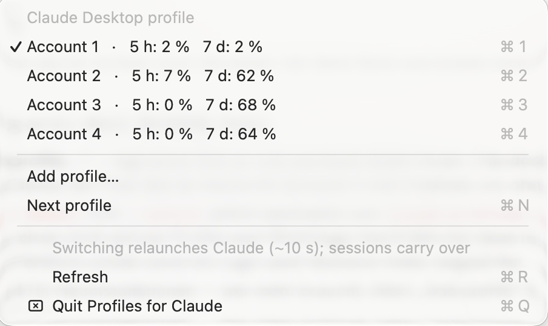

# Profiles for Claude Desktop (macOS)

Use several Claude accounts in **one** Claude Desktop app — switch from the menu bar instead of signing out and back in. Your Claude Code sessions (the *Code* tab) follow you to whichever account is active.

> Unofficial. Not affiliated with or endorsed by Anthropic. It works by moving the app's data directory around, so an app update that changes the internal layout may break it — see [Caveats](#caveats).



## Why

Claude Desktop knows exactly one sign-in at a time. If you keep a personal account and a work account (or one per client), every switch means sign out → sign in → lose your place. This tool gives the app *profiles*, the way Chrome and Slack have them:

- **One app in the Dock.** No second copy of Claude, no `--user-data-dir` juggling.
- **Menu bar switcher.** Shows the active profile and its usage; click another profile to switch. The app relaunches in about ten seconds.
- **Code-tab sessions carry over.** Every profile sees the same session list, so you can continue a session under a different account.
- **Import old sessions.** Sessions you started in the Claude Code CLI or the VS Code extension can be added to the app's sidebar.

## Install

Requirements: macOS 13+, [Claude Desktop](https://claude.ai/download), Xcode Command Line Tools (`xcode-select --install`, needed to compile the tiny menu bar app).

```bash
git clone https://github.com/erorplex/claude-desktop-profiles-macos.git
cd claude-desktop-profiles-macos
./install.sh
```

This installs the `claude-profiles` CLI to `~/.local/bin`, builds **Profiles for Claude.app** into `/Applications`, starts it and adds it to your login items. Your current sign-in becomes profile 1.

The app is ad-hoc signed (no Apple developer account involved). If macOS refuses to open it, right-click → *Open* once.

## Use

Click the person icon in the menu bar (top right, next to the clock) and pick a profile. The menu shows the percentage **remaining** in each profile's 5-hour and 7-day windows — plus every per-model window and confirmed reset times, once you have [recorded them](#plan-limits-in-the-menu). The menu bar highlights whichever general limit has less remaining: for example, 14% used over five hours and 96% used over seven days becomes **7 d 4% left**. Per-model caps remain visible in the menu without being presented as a limit on the entire account. The menu also shows how old the cached usage is; Refresh rereads saved data, it does not query Claude's servers. ⌘1–⌘9 switch directly.

**Adding an account:** choose *Add profile…*. Claude relaunches signed out — sign in with the other account and open the *Code* tab once. Wait for the switcher to relaunch Claude again and confirm that sessions were added before starting work. From then on the profile stays signed in. Repeat for as many accounts as you have. If sign-in takes more than about 15 minutes, finish signing in and opening the Code tab, then switch away and back to sync sessions.

Everything is also available from the terminal:

```bash
claude-profiles                 # status
claude-profiles 2               # switch to profile 2 (or: claude-profiles work)
claude-profiles next            # next signed-in profile
claude-profiles add work        # new profile slot (add --switch: switch into it right away)
claude-profiles remove 3        # delete a parked profile's sign-in and data (asks first)
claude-profiles label 2 work    # name a profile
claude-profiles sync --dry-run  # check existing sessions/workspaces without restarting
claude-profiles sync            # repair the current profile after upgrading (relaunches Claude)
```

### Import sessions from the CLI or VS Code

```bash
claude-profiles import --dry-run                 # show what would be added
claude-profiles import                           # add them to the active profile
claude-profiles import --archive-older-than 14   # older sessions go to the archive (default: 30 days)
claude-profiles import --exclude ~/some/dir      # skip sessions from a directory (repeatable)
```

Titles come from the first message; sessions whose working directory no longer exists, empty ones, and ones in temp folders are skipped. Running it again adds only new sessions. Restart Claude once if the sidebar does not update.

### Plan limits in the menu

Claude Desktop writes how full the 5-hour and the 7-day window are into `plan-usage-history.json` — but not the per-model windows and not when a window resets. Those numbers exist only inside the app, for the account that is signed in right now. `usage-record` stores them next to the app's own file:

```bash
claude-profiles usage-record < plan.json   # plan.json: the plan block as get_usage reports it
```

The simplest way to produce that file is a Claude Code session in the app itself — ask Claude to *"read my plan limits and record them with `claude-profiles usage-record`"*, and it pipes its own usage data in. No token, no network call: the command only reads what you hand it.

Without a record, reset times are omitted. A decrease in cached usage can reflect a correction or other change and does not prove the weekly reset schedule. Older versions inferred a date from these drops; this could incorrectly show Monday when Claude itself reported Friday. A `~` marker did not make that estimate reliable, so reset estimation has been removed.

When a session runs into a limit, the app notes the exact reset time so it can resume the session later (`autoResumeRateLimit.<account>` in `claude_desktop_config.json`). The switcher reads that too: an account that is blocked shows *when* its 5-hour window frees up, even if no recording could be made — which is exactly the moment a recording session cannot start.

A record belongs to its account and travels with it. Expired reset timestamps are cleared rather than extrapolated into a future window. While an account is active, saved usage samples update the 5-hour and 7-day percentages; the menu can therefore lag behind Claude's live Usage card. Per-model percentages stay at their recorded value until you record again. Use Claude's Usage card as the authority and record fresh plan data to update confirmed reset dates.

## How it works

Claude Desktop keeps everything about the signed-in account in `~/Library/Application Support/Claude`. The active profile *is* that directory; every other profile is parked in `~/Library/Application Support/Claude-profiles/<N>`. A switch:

1. validates the session cards and prepares the sync before asking Claude to quit gracefully,
2. reads the final saved state again after Claude exits, connects all profiles to shared scratch workspaces, and syncs the Code-tab index and matching Git worktree registrations into the parked target — titles, permission modes and archiving travel along, while account-bound fields (connectors, remote-control links) stay with the target,
3. renames the active directory into the parking lot and the target directory into place (two renames, sub-second, no copying),
4. relaunches Claude.

Session transcripts and subagent histories live in `~/.claude/projects` and are already shared by all profiles. The switcher leaves those files untouched. Local MCP servers (`claude_desktop_config.json`) are shared too. Credentials stay in their own profile directory; the switcher does not extract them or sign in on your behalf — sign-in happens in Claude's own flow.

**Working folders now follow their sessions.** Earlier versions copied session cards without `scratch-workspaces` or `git-worktrees.json`. A switch could therefore show "Working folder no longer exists" or try to create a Git branch already checked out in the session's original worktree. On the first switch (or `sync` after upgrading), scratch directories from every profile are consolidated under `Claude-profiles/shared/scratch-workspaces`; each profile gets a directory symlink to that stable location. Existing absolute session paths stay valid. Original directories remain under `shared/workspace-backups`. Different contents at the same path stop migration and identify both originals instead of silently picking one. Later edits and deletions affect the shared tree directly, so stale profiles cannot restore old files.

Git worktrees stay where they are. Their registry entries, leases and existing local origin records are merged to match each session's exact workspace identifiers before Claude launches. Workspace identifiers are carried together, so a recovered session cannot get its old path back through a field-by-field majority. The switcher does not detach branches, reset changes, run `git clean`, or recreate worktrees. Unknown registry schemas and ambiguous/missing registrations stop the switch for inspection.

A session can also fail when its checkout still exists but its **original launch folder** was a temporary worktree that has since been removed. During sync, the switcher can replace that missing origin with the main checkout only when both folders were already recorded in the session's Git anchors and the live checkout resolves to the exact same Git common directory. It preserves the conversation's cwd, branch and transcript. It does not guess replacements for missing working directories or remote sessions. When Claude's own **Choose folder** creates a continuation and archives the original, the registry lease follows the unique active continuation in the same checkout; another active session's lease is never taken.

**Missing session cards never delete other copies.** A card can be missing because of an incomplete write, an app change, or a manual deletion; the switcher cannot distinguish these cases reliably. Existing copies are preserved, and a missing card is restored when switching into that profile. Use **Archive** to hide a session across profiles. This changes the previous behavior that propagated session deletions automatically.

Malformed or unreadable cards stop a switch with an error instead of being skipped. The error identifies the file to repair or restore. JSON writes use atomic replacement, and catchable write or activation failures roll back files already changed. Concurrent switches are rejected. These protections do not replace a backup: a process crash or power loss can still interrupt a multi-file switch; `repair` only fixes directory placement, not damaged JSON.

### What travels with you

Only one profile is in use between two switches, so whatever differs there from the state recorded at the previous switch is a real change and wins; a profile you have not visited for a while is stale, not changed. The state of the last switch is kept in `Claude-profiles/shared/sessions-snapshot.json`. This is what carries titles, permission modes and archiving, none of which touch a session's last-activity timestamp:

| | |
|---|---|
| Sessions, titles, permission mode | `claude-code-sessions/<account>/<org>/local_*.json` |
| Archived / restored | `archived-sessions.idx` plus `isArchived` per entry |
| Which session sits in which sidebar group | `claude_desktop_config.json` → `preferences.epitaxyPrefs.dframe-group-scopes` |
| Local MCP servers, pins | `claude_desktop_config.json` |
| Routines (scheduled tasks) | `claude-code-sessions/<account>/<org>/scheduled-tasks.json` |
| Scratch folders, including empty folders and symlinks | Shared `scratch-workspaces` tree |
| Git worktree ownership and origin records | `git-worktrees.json` |

Groups are matched by **name**, since each account has its own group ids.

Routines keep their prompts in `~/.claude/scheduled-tasks`, which every profile shares anyway — but the app registers the *schedule* per account. A switch carries every registration into the target, with the newest run state, so a slot that already ran in one account is not caught up again in the next. A routine deleted in the profile you just left is removed from all profiles at once.

## Caveats

- **Chats in the Chat tab stay with their account.** They live on Anthropic's servers; only Code-tab sessions carry over.
- **Cloud artifacts also belong to their account.** A preserved Code conversation can contain an artifact link that is unavailable after switching accounts. Local HTML/files remain available, but this tool does not republish cloud artifacts.
- **The groups themselves stay with their account.** The sidebar store is synced per account by Claude itself (`ccd/dframe-store`), so the app restores that account's own group names and their order on launch and overwrites anything written locally. Which session sits in which group does travel; creating, renaming or reordering a group has to be done once per account.
- **One account at a time.** Finish running responses before switching: switching relaunches the app and may interrupt them. If Claude refuses to quit, times out, or remains running, the switch stops without moving profile directories. The switcher never sends SIGTERM or SIGKILL; quit Claude manually and retry.
- **Relies on the app's internal layout.** The session index format and `plan-usage-history.json` are not public APIs. If an update changes them, run `claude-profiles repair`, check `~/Library/Logs/claude-profiles.log`, and open an issue.
- **Sign in with one profile at a time.** The browser sign-in returns to the app via a URL callback; make sure only the intended profile is running while you sign in (that is always the case unless you also start Claude with `--user-data-dir` yourself).

## Terms of use

This is for people who own several Claude accounts and want to use them comfortably from one Mac. Anthropic's terms allow multiple accounts but prohibit account sharing, reselling access, and using subscription credentials outside Anthropic's own apps — this tool does none of that, and please don't use it to. Note that advertised usage limits assume ordinary individual use. See Anthropic's [Consumer Terms](https://www.anthropic.com/legal/consumer-terms) and [usage policy](https://code.claude.com/docs/en/legal-and-compliance).

## Uninstall

```bash
./uninstall.sh
```

Removes the CLI and the menu bar app. The active profile stays in place. Keep `~/Library/Application Support/Claude-profiles/shared`: the active profile's scratch-workspace symlink points there. Parked profile slots can be removed with `claude-profiles remove` before uninstalling; that does not delete the shared tree. Do not delete the entire `Claude-profiles` directory without first copying the shared workspaces back into the active profile.

## Development

```bash
./tests/test_cli.sh     # end-to-end tests in a sandbox; never touches the real app
python3 tests/test_sync.py   # what a switch carries over, in a sandbox as well
python3 tests/test_safety.py # malformed data, failed writes, quit refusal, concurrent switches
python3 tests/test_workspaces.py # repeated switches, dirty Git worktrees, migration and rollback
python3 tests/test_usage.py  # confirmed reset dates only
swiftc -o /tmp/test-menu menubar/Usage.swift tests/menu/main.swift && /tmp/test-menu
```

`bin/claude-profiles` is a single Python 3 file with no dependencies; `menubar/main.swift` is the menu bar app, with usage presentation in `menubar/Usage.swift`.

## License

MIT
